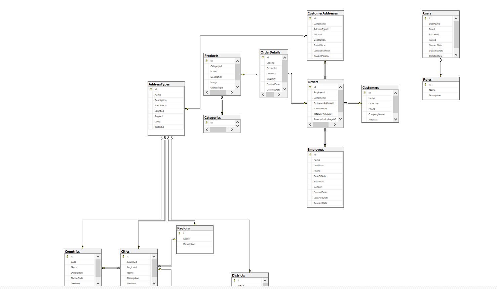

# SQL-StaffCustomersFollowingDb
# IEATestDb Veritabanı

Bu depo, IEATestDb isimli SQL veritabanı hakkında bilgiler içerir. Veritabanının şema tasarımını, tablo yapılarını ve ilişkilerini gösterir.

## Nasıl Kullanılır

1. Veritabanı Oluşturma
   - SQL Sunucusunda yeni bir veritabanı oluşturmak için [IEATestDb.sql](SQL-StaffCustomersFollowingDb.sql
) dosyasını kullanın.

2. Tablolar ve İlişkiler
   - Bu veritabanı şu tabloları içerir:
     - AddressTypes
     - Categories
     - Cities
     - Countries
     - CustomerAddresses
     - Customers
     - Districts
     - Employees
     - OrderDetails
     - Orders
     - Products
     - Regions
     - Roles
     - Users

3. İlişkiler
   - Tablolar arasındaki ilişkiler, yabancı anahtar (foreign key) kısıtlamalarıyla tanımlanmıştır.

4. SQL Sorguları
   - Örnek SQL sorguları ve veri manipülasyon işlemleri yapmak için SQL Server Management Studio veya benzer bir araç kullanabilirsiniz.

## Tablo Örnekleri

## İletişim

Bu veritabanı hakkında herhangi bir sorunuz veya öneriniz varsa, lütfen iletişime geçmekten çekinmeyin.

---

**Not:** Bu veritabanı ve tablo yapıları varsayılan verilerle dolu değildir. Veri eklemek ve yönetmek için uygun sorguları kullanmanız gerekecektir.

